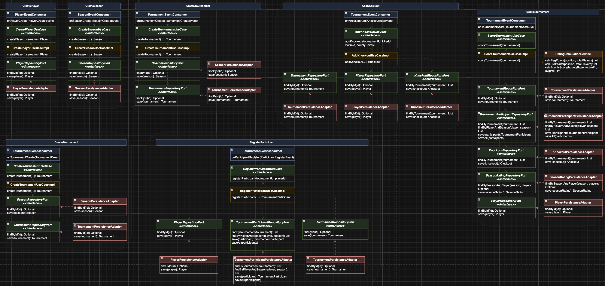
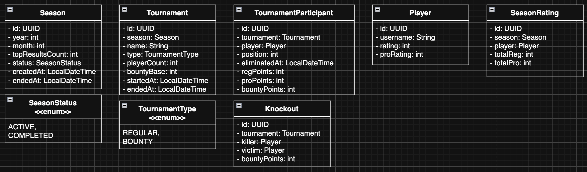

# Poker Rating Service

Внутренний микросервис для подсчёта и хранения рейтингов покерного клуба.

## О проекте

**Стек:** Java 21, Spring Boot 3, PostgreSQL, Flyway, Confluence Kafka

Архитектурные слои (Hexagonal):

- **`domain`** — чистая бизнес-логика без зависимостей на фреймворки. Содержит модели, доменные сервисы и интерфейсы портов (`port/in` — входные use cases, `port/out` — выходные репозитории).
- **`application`** — реализации use cases, оркестрируют доменную логику.
- **`infrastructure`** — всё внешнее: JPA-адаптеры для PostgreSQL, Kafka-консьюмеры для приёма событий. Реализует порты из `domain`, домен о них не знает.

---

## Logic Diagram

---

## Entity Diagram

---

## Формулы рейтинга

### Регулярный рейтинг

Каждый участник получает REG-очки. Чем больше игроков и выше место — тем больше очков.

$$REG = \left(\frac{N - pos}{N}\right)^{1.2} \times \log_2(N) \times 100$$

| Символ | Значение |
|--------|---------|
| $pos$ | Итоговое место (1 = победитель) |
| $N$ | Количество участников турнира |
| $1.2$ | Степень выпуклости — нелинейная кривая, топ-места вознаграждаются сильнее, но без радикального разрыва |
| $\log_2(N)$ | Масштаб поля — чем крупнее турнир, тем больше очков |

Последнее место всегда получает **0** очков. В турнирах с $N < 6$ очки не начисляются.

**Регулярный рейтинг за сезон** — сумма всех REG-очков:

$$REGULAR\_RATING = \sum_{\text{все турниры}} REG_i$$

---

### PRO-рейтинг

Выявляет сильнейших игроков. Объём не помогает — важны только топовые результаты.

**Шаг 1 — Порог входа.** PRO-очки получают только топ-30% участников:

$$\text{если } \frac{pos}{N} > 0.30 \implies PRO\_score = 0$$

**Шаг 2 — Очки для прошедших порог.** Сначала считается перцентиль (доля обогнанных):

$$percentile = \frac{N - pos}{N - 1}$$

Затем PRO-очки:

$$PRO\_score = 500 \times percentile^{2.5} \times \log_2(N)$$

| Символ | Значение |
|--------|---------|
| $percentile$ | Доля игроков, которых участник обогнал (0 до 1) |
| $500$ | Базовый масштабный коэффициент |
| $2.5$ | Крутизна кривой — резкий разрыв между 1-м и 2-м местом, 2-м и 3-м и т.д. |
| $\log_2(N)$ | Масштаб поля — как в REG |

**Шаг 3 — PRO-рейтинг за сезон.** Считаются только лучшие $K$ результатов:

$$PRO\_RATING = \sum_{i=1}^{K} PRO\_score_i^{\downarrow}$$

| Символ | Значение |
|--------|---------|
| $K$ (`topResultsCount`) | Задаётся при создании сезона. Рекомендуется: $K = 5$ при $\leq 10$ турнирах, $K = 8$ иначе |

---

### Баунти-турнир

Очки делятся между местом и выбиванием соперников:

$$REG\_{total} = REG\_{placement} \times 0.6 + REG\_{bounty} \times 0.4$$

$$PRO\_{total} = PRO\_{placement} \times 0.6 + PRO\_{bounty} \times 0.4$$

За каждое выбивание начисляется:

$$BOUNTY\_score = B \times \left(1 + \frac{PRO_{victim}}{\overline{PRO}}\right)$$

Суммарный баунти-счёт игрока — сумма по всем выбываниям:

$$REG\_{bounty} = \sum_{\text{жертвы}} BOUNTY\_score_j$$

| Символ | Значение                                                                                            |
|--------|-----------------------------------------------------------------------------------------------------|
| $B$ | Базовая стоимость выбивания (50-100).                                                               |
| $PRO_{victim}$ | PRO-рейтинг выбитого игрока на момент турнира                                                       |
| $\overline{PRO}$ | Средний PRO-рейтинг всех участников турнира                                                         |
| $1 + \frac{PRO_{victim}}{\overline{PRO}}$ | Выбить сильного игрока выгоднее. Если $\overline{PRO} = 0$ (начало сезона) — коэффициент $\times 1$ |

---

## Сезон

- Длительность: 1 месяц
- Оба рейтинга обнуляются в конце сезона
- Исторические данные сохраняются в `season_ratings`
